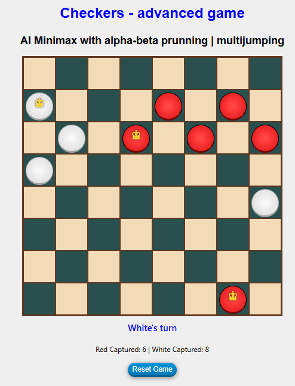

# Checkers | AI | minimax | alpha-beta prunning | multijumping | advanced | Javascript | game 

## Live Link
https://jacekbwwa.github.io/Checkers-multijump-AI-minimax-JB/index.html

## Checkers | Advanced Javascript Game with Multijumping, author: Jacek Byzdra  

## Description general 
- The project presents advanced Checkers game with AI minimax alpha-beta prunning and multijumping.  
- The game is designed for two  players (player vs AI).

#### Board description:
 - The board consists of 64 squares, alternating 32 dark and 32 light squares.
 - Each player starts with 12 pieces placed on the game board. One player has red pieces and the other player has white pieces.
 
#### Rules for pieces movements:
   - A piece can only move diagonally on dark squares.
   - A piece can only move one square per player's turn, unless it jumps or makes several jumps, then it can move a couple of squares per player's turn.
   - After the first player takes their turn, the next player starts their turn.
   - Players can only move one piece per turn, moving one square at a time, unless they jump, then it can move a couple of squares per player's turn.
   - A player moves a piece forward towards the opposing player.
   - When a piece reaches the last row of the opposing side, then that piece becomes the "king" of the game and it's labeled witha crown
   
#### Rules for jumps:
  - A player jumps by jumping their piece diagonally over one of the opponent's piece and landing on an empty dark square on the other side - there must be a free square on which to land.
  - Multiple jumps are allowed in a single turn of the player's movement. This means that if a player jumps their piece diagonally over one of the opponent's piece landing on an empty square and then has the possibility to jump with the same piece over another opponent's piece landing on an empty square, then they make a second jump as part of their turn. And if they still have the possibility to make another jump over another opponent's piece, then they make another jump, until they can no longer make any more jumps in their turn.
  - Piece jumps can be made diagonally both forwards, if there is a free empty square behind the opponent's piece.
  - When a piece  is jumped over ("captured") it is removed from the board and is now out of play. If multiple jumps are made in one turn, then all opponent's pieces that have been jumped over are removed from the board and are out of play.
   
#### Rules for king movements:
  - Kings are more powerful in movement than pieces, because in each turn of the player's movement they can move diagonally forwards and backwards, one square or several squares if they have empty squares in their path.
  - If a player moving his "King" diagonally has an opponent's piece on his way, behind which there is an empty square, or behind which there are several empty squares, then the player jumps his "King" over this opponent's piece, landing on one of these empty squares, and the jumped piece is removed from the board, and if the player then has the possibility to jump with this "King" over another opponent's piece, landing on an empty square, or on one of the empty squares, then the player then makes a second jump with this "King" within one of his turns, and the jumped piece is removed from the board. And if the player then has the possibility to make another jump with this "King", over another opponent's piece, then he makes another jump, until he has no more possibilities to make further jumps within one of his turns.
  - Kings can combine jumps in several directions - forwards and backwards - in the same turn.
  - If a situation arises where a player has the opportunity to jump with their king piece over one opponent's piece diagonally in one direction or over another opponent's piece diagonally in the other direction, then the player decides which jump to  do.

#### Win rules:
  - A player wins the game when the opponent cannot make a move. This is usually because all of the opponent's pieces have been removed from the board after the jumps, and the opponent then has no more pieces to move. Also, when the opponent has no more empty squares to move their piece to, nor can they make a jump with their piece, then the opponent is blocked and cannot move.

#### Feedback information
  - The system displays the following additional information: which player has the move, how many pieces have been removed from the board, and which player wins the game.

## Game phase 1  
- When the game starts, the human player who plays with white pieces starts his move by clicking on his chosen white piece.
- The system then displays possible moves for this selected white piece by marking a light green border on the empty squares of the board available for this move.

## Game phase 2  
- Then the human player playing with the white pieces clicks on one of the empty squares marked with a light green border and that white piece is automatically moved to that selected square.
- After the white player's move, the AI playing with the red pieces takes turn. AI automatically moves one of the selected pieces to the selected square. The AI move is calculated according to minimax alpha-beta prunning algorithm.

## Game phase 3 jump
- When, after clicking on the selected piece, there is an option to jump over the opponent's piece, the system displays this possible jump.
- Then the human player clicks on the displayed empty square behind the opponent's piece and the player's piece is automatically moved to that selected empty square, and the jumped opponent piece is removed from the board.
- After the white player's move, the AI playing with the red pieces takes turn. AI automatically moves one of the selected pieces to the selected square.

## Game phase 4 multi jumps
- If multiple jumps over the opponent's pieces are possible after clicking on the selected piece, the system displays the first possible jump. 
- Then the human player clicks on the displayed empty square behind the opponent's piece. 
- Then, on the same player's move, the system displays the second possible jump, and the human player then clicks on the empty square behind the second opponent's piece. 
- If there are no more jumps possible with this piece, the system removes the opponent's pieces from the board, and the piece itself is automatically moved to the second clicked square and system swicthes players turn. 
- If there is still possible jumps with the same piece, the system would not end the player's move, but would display the next possible jumps after each click on the empty square behind the opponent's piece.
- After the white player's move, the AI playing with the red pieces takes turn. AI automatically moves one of the selected pieces to the selected square.

## Game phase 5 Changing a piece to a king's piece
- When a piece reaches the last row of the opposite side, either by normal movement or by jumping over an opponent, it becomes the "king" of the game and is marked with a crown.

## Game phase 6 king move
- When a player clicks on a king piece, the system displays possible moves for that king. 
- The human player then selects one of the displayed squares and then that king is automatically moved to the selected empty square.
- After the white player's move, the AI playing with the red pieces takes turn. AI automatically moves one of the selected pieces to the selected square.

## Game phase 7 king jump
- When clicking on the selected king, the option to jump over the opponent's piece appears, the system will display this possible jump.
- Then the human player clicks on one of the displayed empty squares behind the opponent's piece, and then this king is automatically moved to this selected empty square, and the jumped opponent's piece is removed from the board.
- After the white player's move, the AI playing with the red pieces takes turn. AI automatically moves one of the selected pieces to the selected square.

## Game phase 8 king multi jumps
- If multiple jumps over the opponent's pieces are possible after clicking on the selected king, the system displays the first possible jump.
- Then the human player clicks on the displayed empty square behind the opponent's piece.
- Then, when the same player moves, the system displays the second possible jump, and the human player clicks on the empty square behind the second opponent's piece.
- If there are no more possible jumps with this king, the system removes the opponent's pieces from the board, and the king itself is automatically moved to the second clicked square, and the system switches the player's turn.
- If there were still possible jumps with the same king, the system would not end the player's move, but would display the next possible jumps after each click on the empty square behind the opponent's piece.
- After the white player's move, the AI playing with the red pieces takes turn. AI automatically moves one of the selected pieces to the selected square.

## Game phase 9 AI king jump
- When AI has possibility to jump with his king over human piece, then AI king automatically jumps over the piece, and moves the king on one of empty square over jumped.

## Game phase 10 AI king multi jumps
- If multiple jumps over the opponent's pieces are possible for AI king, then AI king automatically jumps over possible pieces, and  moves the king on one of empty square over jumped.

## Game phase 11 game over
- When a player cannot make a move, when he is blocked, or when a player has no more pieces to move, the system ends the game and declares the winner.

## Game phase 12 game reset
- When the player clicks the Reset Game button, the system restarts the game to the first phase

## Technologies Used
- HTML/CSS
- JavaScript in a modern ES6+

## Code Explaination
- All the code is in the JavaScript file (checkers.js). 
- The code is based on JS ES6+ arrow functions where applicable, which reflects operations, complete game logic, initial setup for game start, piece selection, highlight movement and jumps for piece, highlight move and jumps for king,  move logic for standard move, for jump and for multi-jump, capturing, finding jump paths for king, event handler on piece and square, render board for UI update, swaping player in the end of turn, checking for piece to king change, AI search depth, block human clicks on AI turn, move Logic for AI, multi-jump generator for AI, minimax with alpha-beta prunning for AI best move and jumps. 
- The integration between the JS and HTML is based on event handlers, UI updates, and board reset button.
- The HTML sets up the DOM elements of the game: the game board, the title, text elements indicating turn status, captured pieces number, interactive elements for resetting the game, etc.
- The CSS sets up layout  of this project, styles the board and pieces to visually represent a checkers game.

### Author

**Jacek Byzdra**  
*Software Developer  
jacek.jaroslaw.byzdra@gmail.com  
[Linkedin](https://www.linkedin.com/in/jacek-byzdra/) - [GitHub](https://github.com/jacekbwwa)*

### License
Privacy policy. This work is available under a Creative Commons License Attribution - Non-Commercial Use - No Derivative Works 4.0 International

# Checkers-multijump-AI-minimax-JB
