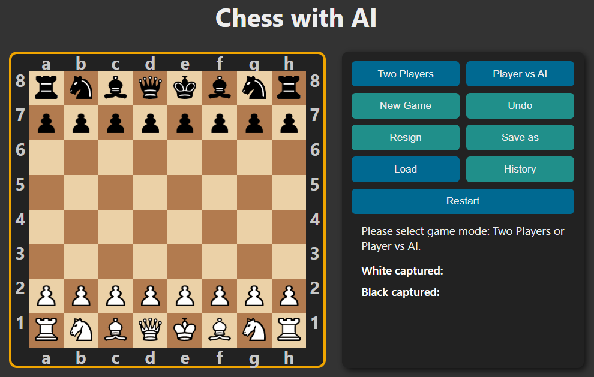
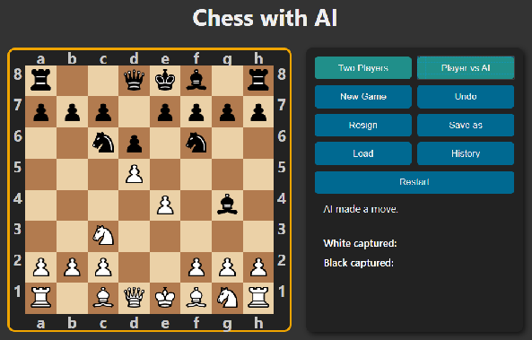
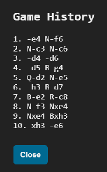
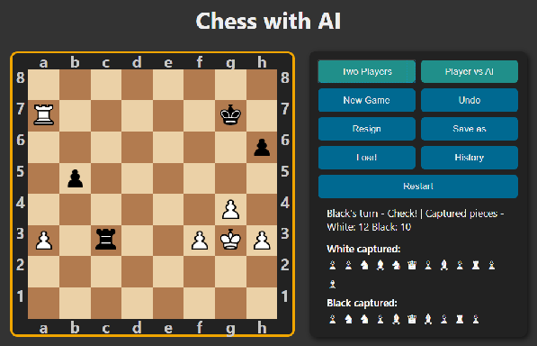

# Chess | AI | minimax | alpha-beta pruning | heuristics evaluation | Javascript | game 

## Live Link
https://jacekbwwa.github.io/Chess-AI-minimax-JB/index.html
- in live link buttons "Save as" and "Load" are disabled to not interfere server space.

## Chess | AI Javascript game with minimax alpha beta pruning, heuristics evaluation, author: Jacek Byzdra  

## Description general 
- The project presents an AI chess game with minimax alpha-beta pruning and position evaluation.
- The game is designed with two modes: "Two Players" and "Player vs. AI."
- The "Two Players" mode is designed for chess between two players (without any artificial intelligence involved).
- The "Player vs. AI" mode is designed for chess between a human and an AI bot.
- The rules of the game are based on standard chess rules (including "en passant" moves, pawn promotion, castling, check, mate, draw, stalemate, etc.).
- The AI chess engine is based on a minimax algorithm with alpha-beta pruning and heuristic position evaluation: each position is evaluated based on the value of the piece and the position on the piece-square board, control of the center, and control of the board space.

#### Board description:
- The board consists of 64 squares, alternating 32 dark and 32 light squares.
- Each player starts the game with 16 chess pieces placed on the board: 1 king, 1 queen, 2 rooks, 2 bishops, 2 knights, and 8 pawns. One player has black pieces, and the other white pieces. In "Player vs. AI" mode, the player has white pieces and the AI has black pieces. The white piece moves first.
- Pieces are represented on the board using HTML symbols.
 
#### Buttons description:
- “Two Players” button – When pressed, the system initiates a chess game between two players (two-player mode).
- “Player vs AI” button - When pressed, the system initiates a chess game between one player and an AI opponent (Player vs. AI mode).
- "Restart” button – When pressed, the system resets the game to initialize the state (where the player can select a game mode).
- “New Game” button  – When pressed, the system initiates a new game in the current mode.
- "Undo" button - When pressed, the system rewinds the game by one move for the player who pressed the "Undo" button.
- “Resign” button – When pressed, the player voluntarily resigns. The opponent wins by default.
- “Save as” button – When pressed, the current game is represented using a JSON structure and then serialized to a file.
- “Load” button - after pressing this button, the system will load the saved chess game from the JSON file.

#### Displayed information:
- The system displays information: when the king is in check, the end of the game, who wins, when there's a draw, which player has a turn, and the game results.
- The system highlights the available moves for the clicked piece.
- The system displays which pieces have been captured.
 
#### Win, draw rules:
- If the king is checkmated, the system ends the game and announces the winner.
- If a player has no legal moves and their king is not in check, the game ends in a draw. This situation is called a stalemate draw. The system then ends the game and announces a draw.
- If neither player can checkmate due to a lack of sufficient pieces, the system ends the game and announces a draw.
- If a player resigns by pressing the "Resign" button, the opponent automatically wins. The system then ends the game and announces the winner.

## Screenshot - beginning of the game

## Screenshot - game in "Two players" mode 

## Screenshot - game in "Player vs AI" mode

## Screenshot - game in "Player vs AI" mode, after pressing the "Save as" button the game is saved to the file "chess_2025-08-02T13-25-46.810Z.json".

## Screenshot - game in "Player vs AI" mode, History button pressed

## Screenshot - game in "Two players" mode, the black king is in check

## Screenshot - game in "Two players" mode, the black king is in checkmate, the white player wins

## Screenshot - game in "Two players" mode, the black pawn has the option to play "en passant" (marked with a red frame)

## Screenshot - game in "Two players" mode, white pawn is promoted

## Technologies Used
- HTML/CSS
- JavaScript in a modern ES6+

## Code Explaination
- All code is in the JavaScript file (chess.js).
- The code is based on JavaScript functions and constants that represent operations, complete game logic, initial game start settings, piece selection, move highlighting, capturing, game state, AI simulation on a cloned board, board rendering and user interface interaction, position verification, move generation and verification for each piece, checking if a square on the board is attacked by pieces, checking if a move is legal, generating a list of all legal moves for a piece, checking the right to castling, highlighting squares according to legal moves of the selected piece, handling clicks on board squares, handling events for piece and square, updating the game state, moving a piece, capturing, promotions, castling, en passant, etc., displaying the promotion dialog and allowing the player to select a piece for promotion, handling captures – displaying captured pieces, saving a move to the history, displaying the move history, undoing the last move for a player who presses the undo button, handling resignations, handling saving and loading, handling history display dialog, game setup and initialization, updating user interface information, active state buttons, checking game end (mate, stalemate, draw), checking piece values on the board, checking for insufficient material (draw), checking draw conditions, checking end conditions, minimax with alpha-beta pruning, finding the best move using minimax with alpha-beta pruning with heuristic position evaluation, listening for board square events, AI search depth, blocking human clicks during the AI turn, AI move logic.
- The evaluation function is based on piece values and  piece-square tables. Additional the function adds bonus for: control of center, control of space, check/checkmate.
- The material values for pieces are following: pawn: 100, knight: 300, bishop: 320, rook: 500, queen: 900, king: 10000.
- The game is split to three phases: opening, middle and end. For each phase separate piece-square tables are designed for each piece of each color. The piece-square tables are used to score points based on the current position of the chess piece.
- The piece-square tables are designed to promote piece behavior in various phases of the game. The opening phase promotes control of the center and castling. The middle phase promotes control of space, attacking the king, and securing one's own king. The end phase focuses on pawn promotion, attacking the king, and mate the king.
- The integration between the JS and HTML is based on event handlers, UI updates, and board reset button.
- The HTML sets up the DOM elements of the game: the game board, the title, text elements indicating turn status, captured pieces number, interactive elements for resetting the game, etc.
- The CSS sets up layout  of this project, styles the board and pieces to visually represent a chess game.

### Author

**Jacek Byzdra**  
*Software Developer  
jacek.jaroslaw.byzdra@gmail.com  
[Linkedin](https://www.linkedin.com/in/jacek-byzdra/) - [GitHub](https://github.com/jacekbwwa)*

### License
Privacy policy. This work is available under a Creative Commons License Attribution - Non-Commercial Use - No Derivative Works 4.0 International

