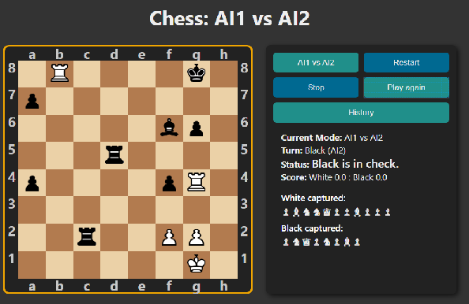
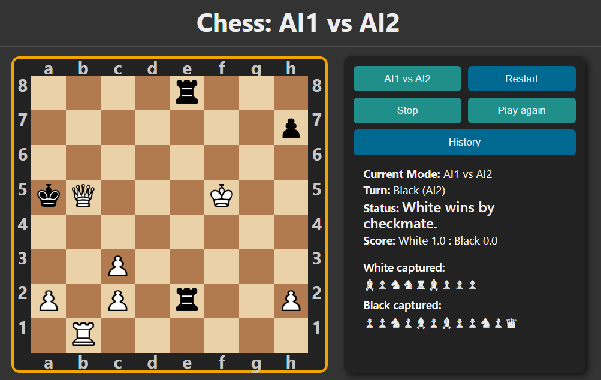
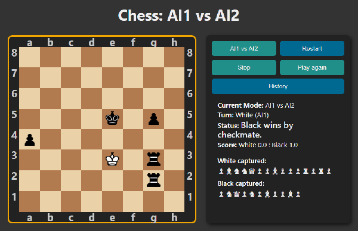

# Chess | AI | AI vs AI | minimax | alpha-beta pruning | heuristics | position evaluation | Web Worker | Javascript | game 

## Live Link
https://jacekbwwa.github.io/Chess-AI-vs-AI-minimax-Web-Worker-JB/index.html

## Chess | AI vs AI Javascript Game with minimax alpha beta pruning, heuristic position evaluation, Web Worker,  author: Jacek Byzdra  

## Description general 
- The project presents an AI vs AI chess game with minimax alpha-beta pruning, heuristic position evaluation, Web Worker.
- The game is designed with one mode: "AI1 vs AI2", which is designed for chess between two AI players.
- The rules of the game are based on standard chess rules (including "en passant" moves, pawn promotion, castling, check, mate, draw, stalemate, etc.).
- The AI chess engine is based on a minimax algorithm with alpha-beta pruning, advanced heuristic position evaluation and Web Worker (with game logic) which runs in the background threat, allowing the main (UI) thread to run without being blocked/slowed down.
- The heuristic position evaluation includes following scores for each position: material, piece-square tables, control of center, bonus for castling, threat, center threat, bonus for check, coverage of king before attack, capture values, bonus for promoting pawn, piece attack, penelty for repetition, bonus for queen stillness in opening phase, bonus for attacking king's adjacency squares, bonus for king stillness in opening phase.
  - The material values for pieces are following: pawn: 100, knight: 300, bishop: 320, rook: 500, queen: 900, king: 10000. The material score is calculated by counting the value of all the pieces on the board for each AI player.
  - The game is split to three phases: opening, middle and end. For each phase separate piece-square tables are designed for each piece of each color. The piece-square tables are used to score points based on the current position of the chess piece. The opening phase promotes control of the center and castling. The middle phase promotes control of space, attacking the king, and securing one's own king. The end phase focuses on pawn promotion, attacking the king, and mate the king.
  - Center Control adds a bonus for controlling the center of the board, differentiated by when there is an AI opponent attacking the center of the board and when there is an AI player counterattacking the center of the board.
  - Center Threat Control counts the number of attacks by the AI opponent and the AI player on the center of the board.
  - Castling results add a bonus for castling performed in the opening and middle phases.
  - Attack Threat Control counts the number of squares attacked on the board by the AI opponent and the AI player.
  - Controlling a check gives a check bonus, the value of which depends on whether the AI player counterattacks an AI opponent who checks the king.
  - Controlling the King's Cover from Attack gives a King's Cover from Attack bonus, the value of which depends on whether the AI player counterattacks an AI opponent who attacks a blocking piece.
  - The capture value result gives a bonus for capturing a piece whose value is greater than the value of the capturing piece.
  - The promotion result adds a bonus for promoting a pawn to a queen in the end phase.
  - The result of attacks gives a bonus for an attack by the AI player's pieces on the opponent's AI pieces when there is no counterattack by the opponent's AI or when such a counterattack is counterattacked by the AI player, with this bonus being greater when a higher-value piece is attacked by a lower-value piece.
  - The repetition score gives a huge penalty when an AI player or AI opponent repeats the same position three times. As a result, such repetitions no longer occur.
  - Queen Immobility Control (queenstillness)) gives a bonus for not moving the queen during the opening phase.
  - Controlling attacks on adjacent squares of the AI king grants a bonus for attacking adjacent squares of the opposing AI king in the end phase. The bonus is greater when the AI player's king also participates in an attack on adjacent squares of the opposing AI king.
  - King Immobility Control (kingtillness)) gives a bonus for not moving the king during the opening phase (besides castling).
  
#### Board description:
- The board consists of 64 squares, alternating 32 dark and 32 light squares.
- Each AI player starts the game with 16 chess pieces placed on the board: 1 king, 1 queen, 2 rooks, 2 bishops, 2 knights, and 8 pawns. One AI player has black pieces, and the other white pieces. The white piece moves first.
- The pieces on the board are represented by chess symbols.
 
#### Buttons description:
- “AI1 vs AI2” button – When pressed, the system initiates a chess game between two AI players (“AI1 vs AI2” mode).
- "Restart” button – When pressed, the system resets the game to initialize the state (where human can choose the mode of the game).
- "Stop" button  – When pressed, the system pauses the game.
- "Play again" - When pressed, the system resumes paused game after previous pressed "Stop" buton.
- "History" button – When pressed, the system displays a complete history of the current gamet.

#### Displayed information:
- The system displays information: when the king is in check, the end of the game, who wins, when there's a draw, which AI player has a turn, and the game results.
- The system displays which pieces have been captured.
 
#### Win, draw rules:
- If the king is checkmated, the system ends the game and announces the winner.
- If a player has no legal moves and their king is not in check, the game ends in a draw. This situation is called a stalemate draw. The system then ends the game and announces a draw.
- If neither player can checkmate due to a lack of sufficient pieces, the system ends the game and announces a draw.

## Screenshot - beginning of the game

## Screenshot - game paused.

## Screenshot - the black king is in check

## Screenshot - the white king is in check

## Screenshot - History button pressed

## Screenshot - the black king is in checkmate, the white player wins

## Screenshot - the white king is in checkmate, the black player wins

## Technologies Used
- HTML/CSS
- JavaScript in a modern ES6+

## Code Explaination
- All code is in two JavaScript files (chess.js and worker.js). The UI logic is in chess.js and game logic is in worker.js. The worker.js is Web Workerwhich runs in the background threat.
- The code is based on JavaScript functions and constants that represent operations, complete game logic, initial game start settings, piece selection, move highlighting, capturing, game state, AI simulation on a cloned board, board rendering and user interface interaction, position verification, move generation and verification for each piece, checking if a square on the board is attacked by pieces, checking if a move is legal, generating a list of all legal moves for a piece, checking the right to castling, highlighting squares according to legal moves of the selected piece, handling clicks on board squares, handling events for piece and square, updating the game state, moving a piece, capturing, promotions, castling, en passant, etc., handling captures – displaying captured pieces, saving a move to the history, displaying the move history, handling history display dialog, game setup and initialization, updating user interface information, active state buttons, checking game end (mate, stalemate, draw), checking piece values on the board, checking for insufficient material (draw), checking draw conditions, checking end conditions, minimax with alpha-beta pruning, finding the best move using minimax with alpha-beta pruning with heuristic position evaluation, listening for board square events, AI search depth, AI move logic, handle Web Worker messages, handle  material values for pieces, handle center control, handle center threat control, handle castling promotion, handle attack threat control, handle controlling a check attacks, handle controlling the king's cover, handle  controlling attacks on adjacent squares of the king.
- The heuristic evaluation function is based on material, piece-square tables, control of center, bonus for castling, threat, center threat, bonus for check, coverage of king before attack, capture values, bonus for promoting pawn, piece attack, penelty for repetition, bonus for queen stillness in opening phase, bonus for attacking king's adjacency squares, bonus for king stillness in opening phase.
  - The material values for pieces are following: pawn: 100, knight: 300, bishop: 320, rook: 500, queen: 900, king: 10000. The material score is calculated by counting the value of all the pieces on the board for each AI player.
  - The game is split to three phases: opening, middle and end. For each phase separate piece-square tables are designed for each piece of each color. The piece-square tables are used to score points based on the current position of the chess piece. The opening phase promotes control of the center and castling. The middle phase promotes control of space, attacking the king, and securing one's own king. The end phase focuses on pawn promotion, attacking the king, and mate the king.
  - Center Control adds a bonus for controlling the center of the board, differentiated by when there is an AI opponent attacking the center of the board and when there is an AI player counterattacking the center of the board.
  - Center Threat Control counts the number of attacks by the AI opponent and the AI player on the center of the board.
  - Castling results add a bonus for castling performed in the opening and middle phases.
  - Attack Threat Control counts the number of squares attacked on the board by the AI opponent and the AI player.
  - Controlling a check gives a check bonus, the value of which depends on whether the AI player counterattacks an AI opponent who checks the king.
  - Controlling the King's Cover from Attack gives a King's Cover from Attack bonus, the value of which depends on whether the AI player counterattacks an AI opponent who attacks a blocking piece.
  - The capture value result gives a bonus for capturing a piece whose value is greater than the value of the capturing piece.
  - The promotion result adds a bonus for promoting a pawn to a queen in the end phase.
  - The result of attacks gives a bonus for an attack by the AI player's pieces on the opponent's AI pieces when there is no counterattack by the opponent's AI or when such a counterattack is counterattacked by the AI player, with this bonus being greater when a higher-value piece is attacked by a lower-value piece.
  - The repetition score gives a huge penalty when an AI player or AI opponent repeats the same position three times. As a result, such repetitions no longer occur.
  - Queen Immobility Control (queenstillness)) gives a bonus for not moving the queen during the opening phase.
  - Controlling attacks on adjacent squares of the AI king grants a bonus for attacking adjacent squares of the opposing AI king in the end phase. The bonus is greater when the AI player's king also participates in an attack on adjacent squares of the opposing AI king.
  - King Immobility Control (kingtillness)) gives a bonus for not moving the king during the opening phase (besides castling).
- An advanced heuristic evaluation function is performed on each leaf of the minimax search algorithm with alpha-beta pruning. This significantly reduces the number of possible moves to be searched (selecting the best ones based on the heuristic evaluation). Due to the very complex heuristic evaluation function, the system performs a large number of operations, slightly delaying each move.
- The integration between the JS and HTML is based on event handlers, UI updates, and board reset button.
- The HTML sets up the DOM elements of the game: the game board, the title, text elements indicating turn status, captured pieces number, interactive elements for resetting the game, etc.
- The CSS sets up layout  of this project, styles the board and pieces to visually represent a chess game.

### Author

**Jacek Byzdra**  
*Software Developer  
jacek.jaroslaw.byzdra@gmail.com  
[Linkedin](https://www.linkedin.com/in/jacek-byzdra/) - [GitHub](https://github.com/jacekbwwa)*

### License
Privacy policy. This work is available under a Creative Commons License Attribution - Non-Commercial Use - No Derivative Works 4.0 International

