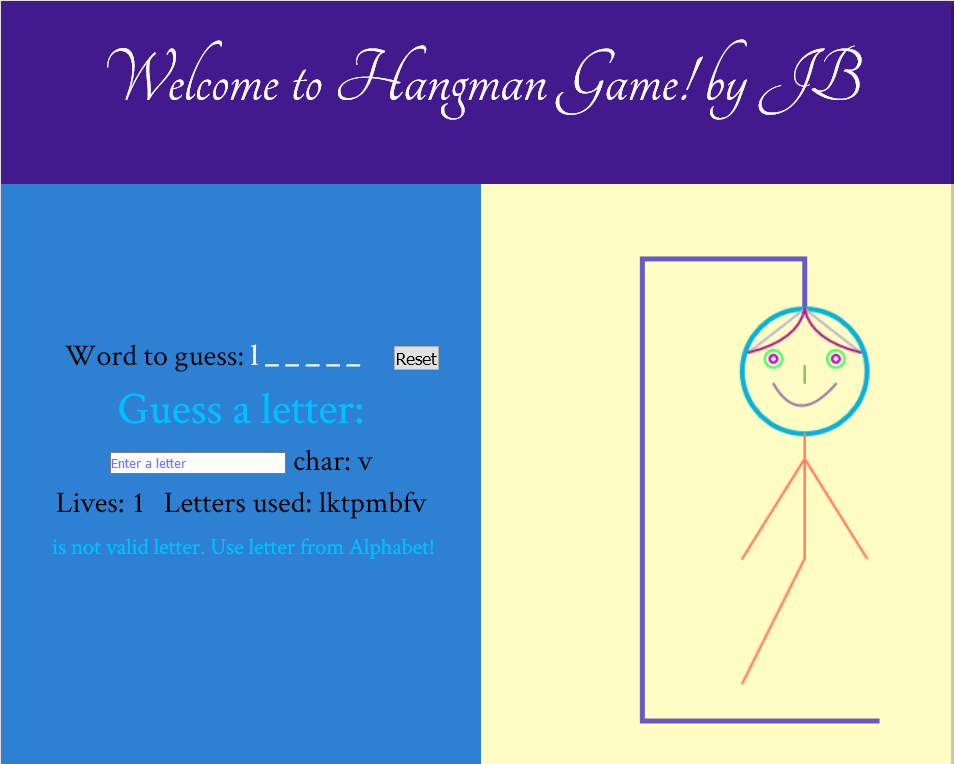

# Hangman | Javascript | Canvas | Game
## Hangman game built in Javascript, with draw on the canvas With JavaScript.

## Live Link
https://jacekbwwa.github.io/Hangman-canvas-JB/index.html

## Description
- The game is a words guessing game for one player. 
- The word to guess is represented by a row of dashes, representing each letter of the word.
- The player chooses dictionary, then the computer guesses a word
and the user suggests letters one by one. 
- In the beginning the user has 8 trials (8 lives).
- Every time the word doesn't contain a letter, 
the computer gives a penalty point, that's remove one life.
- If there is 0 lives, the user looses.
- The user wins when he guesses all letters.
- The picture of gallows is drawn when user miss the letter.

## Technologies Used
- HTML/CSS
- JavaScript 
- Web Fonts (from Google Fonts)
- Addapted to PC/mobile browsers

## Code Explaination
- All the code is in the JavaScript file (index.js). The game logic is based on display and play game functions, which invoke draw methods. 
- The HTML sets up the DOM elements of the game: the game board, the title, text elements indicating status, guessed letters and lives, etc.
- The CSS sets up layout  of this project, giving the colors , rows, columns and margins, etc. Used css grid layout made it easier to design web pages.
- External Google web fonts were added to beautify text

### Author

**Jacek Byzdra**  
*Software Developer  
jacek.jaroslaw.byzdra@gmail.com  
[Linkedin](https://www.linkedin.com/in/jacek-byzdra/) - [GitHub](https://github.com/jacekbwwa)*

### License
Privacy policy. This work is available under a Creative Commons License Attribution - Non-Commercial Use - No Derivative Works 4.0 International
# Hangman-canvas-JB
