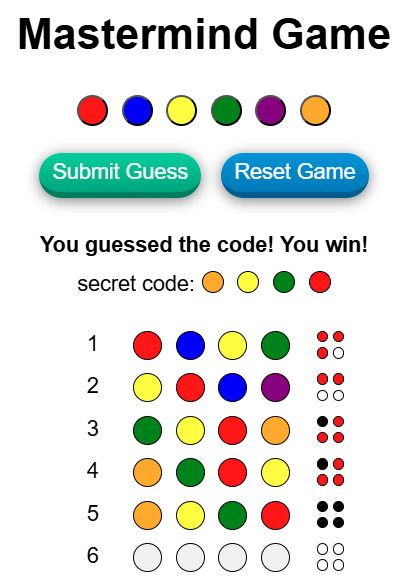

# Mastermind | Javascript | Game | Advanced

## Live Link
https://jacekbwwa.github.io/MasterMindJB/index.html

## Mastermind | Advanced Javascript Game , author: Jacek Byzdra  

## Description 
- The project presents a Mastermind game for one player.  
- The object of the Mastermind game is to guess a secret code consisting of a series of 4 colored code pegs.
- The code pegs are in 6 different colors: red, blue, yellow, green, purple, orange.
- The player tries to guess the code by placing different combinations of four pegs in each row of the game board.
- The feedback of the guess is shown by Codemaker (computer) in either in black or in red keys pegs, on the key pegs board, regarding how many of the pegs are in the correct position (black key) or correct color (red key).
- The player tries to win by guessing the code within their 10 rows of guesses on the game board

## Game phase 1  
- The Codemaker (computer) secretly places any four code pegs in the code area then conceals them with the code shield. The Codemaker can use any combination of colors, including using two or more of the same color.

## Game phase 2  
- The player places a code peg by clicking on a color on the color board and on a hole in the first row of holes. The player then places the next code pegs, trying to reproduce the exact colors and positions of the secret code in the first row of holes.

## Game phase 3
- After placing the 4 code pegs in the first row of holes, the player clicks the Submit Guess button to verify the guessed code.

## Game phase 4
- The Codemaker (computer) places key pegs in the key holes on the 1st row as follows:
  - A black  key peg for each code peg that's the right color and in the right position.
  - A red key peg for each code peg that's the right color, but not in the right position.
  - No key pegs indicate a color is not used in the code.
- The Codemaker (computer) does not put the key pegs in any particular order. It's part of the challenge for the player to figure out which key pegs correspond to which code pegs. 

## Game phase 5
- The player places another set of Code Pegs in the second row and presses the Submit Guess button, then the Codemaker (computer) places key pegs in his second row. 

## Game phase 6

- The player keeps placing rows of code pegs and keeps getting feedback from the Codemaker (computer) until he guesses the code exactly. 

## Game phase 7
- When the player guesses the code, the Codemaker places four black key pegs and reveals the secret code and information that player wins is displayed.

## Game phase 8
- When player wants to play once again the game he presses the Reset Game button and the game starts from phase 1.

## Technologies Used
- HTML/CSS
- JavaScript in a modern ES6+

## Code Explaination
- All the code is in the JavaScript file (mastermind.js) and in the sript. 
- The code is based on JS classes, and static methods for direct calls. Each class with methods reflects related operations.
- The code contains the complete game logic, including generating a random secret code, rendering the boards, handling user interactions, calculating feedback, and checking win/loss conditions.
- The strucure of the code is modular that manages the game's logic, interaction, and feedback.
- The code is created to work seamlessly when served through a web server.
- The integration between the JS and HTML is based on event listeners, UI updates, and board button clicks to action.
- The HTML sets up the game interface with a board for pegs, color selection buttons, and controls to submit guesses and reset the game.
- The CSS sets up layout  of this project and provides basic styling for the elements to look visually appealing.

### Author

**Jacek Byzdra**  
*Software Developer  
jacek.jaroslaw.byzdra@gmail.com  
[Linkedin](https://www.linkedin.com/in/jacek-byzdra/) - [GitHub](https://github.com/jacekbwwa)*

### License
Privacy policy. This work is available under a Creative Commons License Attribution - Non-Commercial Use - No Derivative Works 4.0 International

# Matermind-JB
# Matermind-JB
