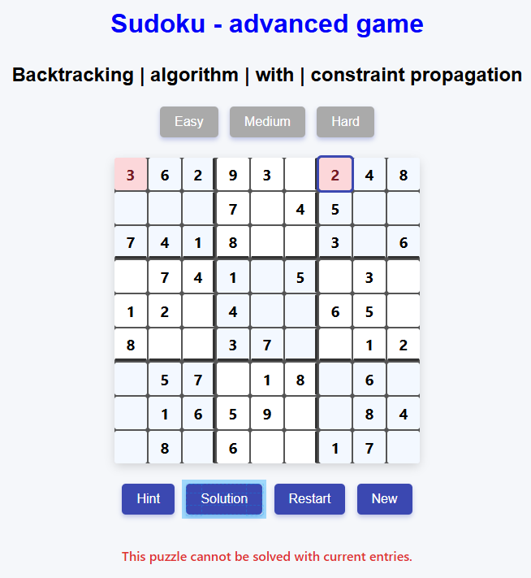

# Sudoku | game | backtracking | algorithm | with | constraint propagation

## Live Link

https://jacekbwwa.github.io/Sudoku-backtracking-cp/index.html

## Sudoku | Advanced Javascript Game , author: Jacek Byzdra

## Description

- The project presents a Sudoku puzzle game for one player.
- Sudoku puzzle grid consists of 9 x 9 cells.
- Within the rows and columns of the grid are 9 boxes (made up of 3 x 3 cells).
- Each box of the grid can only contain numbers from 1 to 9.
- Each vertical column of the grid can only contain numbers from 1 to 9.
- Each horizontal row of the grid can only contain numbers from 1 to 9.
- The goal is to fill a 9x9 cells with digits from 1 to 9, so that each column, each row, and each of the nine 3x3 boxes
  contain all of the digits from 1 to 9 without any repetition within the row, column or subgreed.
- There are 3 modes of the game (easy, medium, hard), where a few spaces are already filled in by the system, depends on
  the mode of the game.
- Player will invoke Sudoku program pressing either 'easy' button, or 'medium' button, or ' hard' button.
- Player entries the number to empty cell from the keyboard numbers (1-9).
- When player press the 'hint' button system will highlight in small size possible numbers (in different colours) to
  entry in each empty cell, without any repetition within the row, column or box. When player press once again the
  'hint' button system will cancel the highlight.
- Whem player press the 'restart' button the game is restarted to the current mode.
- Whem player press the 'new' button the game is restarted to initial state.
- When player press the 'solution' button system will find solution of the puzzle and display missing numbers in empty
  cells.
- When player entries incorrect number (or numbers) and presses 'solution'button system will display incorrect number (numbers) in red colour.

## Game screenshots

## Technologies Used

- HTML/CSS
- JavaScript in a modern ES6+

## Code Explaination

- All the code is in the JavaScript file (sudoku.js).
- The code is based on JS class representation of board cell, and function methods. Each methods reflects related
  operations: clear UI message and hints displayed, create puzzle using solution generator and set clues for mode, generate fully solved Sudoku board with backtracking and constraint propagation, Fisher-Yates algorithm used to randomize the order of elements in an array, filling clues depend on the mode, draw Sudoku board UI, validate entries, update visible UI cell content, show message in message div, collect errors in filled board, mark error cells visually, show possible number hints, remove all hint displays, restart game current mode, restart game to initial state, solve current puzzle using backtracking + constraint propagation, mark incorrect user entries and fill missing values in UI, button event handlers, initialize empty board UI.
- The generated new Sudoku puzzle ( and solved player puzzle) is based on backtracking recursive solver with constraint propagation.
- The integration between the JS and HTML is based on event listeners, UI updates, and board button clicks to action.
- The HTML sets up the game interface with a board for numbers, selection buttons, and controls to submit numbers and
  reset the game.
- The CSS sets up layout of this project and provides basic styling for the elements to look visually appealing.

### Author

**Jacek Byzdra**  
_Software Developer  
jacek.jaroslaw.byzdra@gmail.com  
[Linkedin](https://www.linkedin.com/in/jacek-byzdra/) - [GitHub](https://github.com/jacekbwwa)_

### License

Privacy policy. This work is available under a Creative Commons License Attribution - Non-Commercial Use - No Derivative
Works 4.0 International

# Sudoku-backtracking-cp
