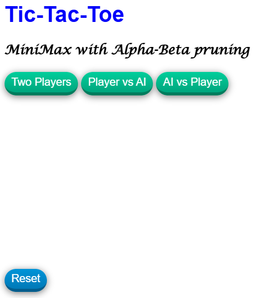
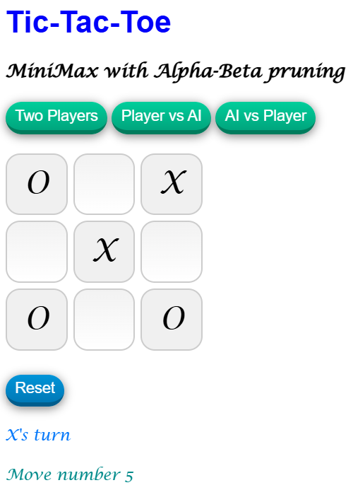
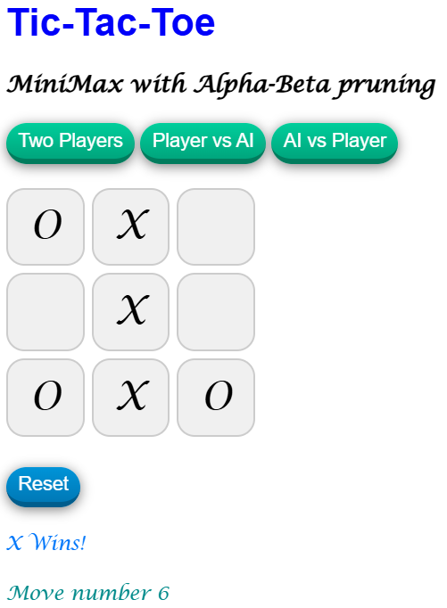
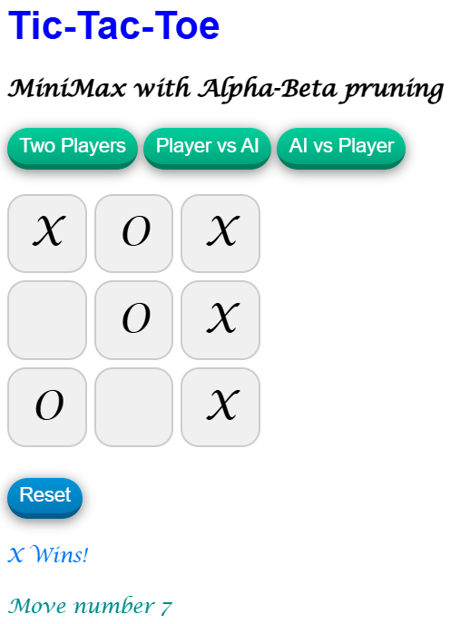

# Tic-Tac-Toe | Javascript | Game | AI | minimax| alpha-beta prunning

## Live Link
https://jacekbwwa.github.io/TicTacToeAiMiniMaxJB/index.html

## Tic-Tac-Toe |  Advanced Javascript Game, with AI Minimax alpha-beta prunning, author: Jacek Byzdra  

## Description 
- The project presents Tic-Tac-Toe game for two players (two players, player vs AI, AI vs player) who take turns marking the spaces in a 3×3 grid.  
- The player who succeeds in placing three of their marks in a horizontal, vertical, or diagonal row is the winner.  

## Game phase 1  
- When the game is started there is option to choose two players from: Two Players, Player vs AI, AI vs Player.  
- When Two Players button is pressed, the game is played between two human persons , step by step.  
- When Player vs AI button is clicked,  the game is played with one human and the computer.  
- When AI vs Player button is pressed,  the game is played with the computer and one human.  

## Game phase 2  
- In Two Players mode first player uses O symbol, and second uses X symbol in the game.
- In Player vs AI and AI vs Player mode human player uses O symbol, and computer uses X symbol in the game.

## Game phase 3
- The players take turns one by one marking the symbols in a 3×3 grid  
- The player who succeeds in placing three of their marks in a horizontal, vertical, or diagonal row is the winner.   
- The score of the game and move number is displayed in the bottom board  
- The button Reset invokes new game between two human persons in Two Players mode. 

## Technologies Used
- HTML/CSS
- JavaScript in a modern ES6+

## Code Explaination
- All the code is in the JavaScript file (ticTacToe.js) and in the sript. 
- The code is based on JS classes, and static methods for direct calls. Each class with methods reflects operations related to modes, resetting the game, and current game state.
- The strucure of the code is modular and promotes separation between game state, UI, and game logic, and allows other files to import classes, constants, and promote code reuse.
- The integration between the JS and HTML is based on event listeners, UI updates, and board button clicks to action.
- The game logic includes win detection and game state management.
- The AI player is supported by the algorithm MiniMax with alpha-beta prunning for best move and winning.
- The HTML sets up the DOM elements of the game: the game board, the title, text elements indicating status, move numbers, interactive elements for starting and resetting the game, etc.
- The CSS sets up layout  of this project, giving the grid layout, colors , rows, columns and margins, etc.

### Author

**Jacek Byzdra**  
*Software Developer  
jacek.jaroslaw.byzdra@gmail.com  
[Linkedin](https://www.linkedin.com/in/jacek-byzdra/) - [GitHub](https://github.com/jacekbwwa)*

### License
Privacy policy. This work is available under a Creative Commons License Attribution - Non-Commercial Use - No Derivative Works 4.0 International

# TicTacToe-AI-Minimax-JB
