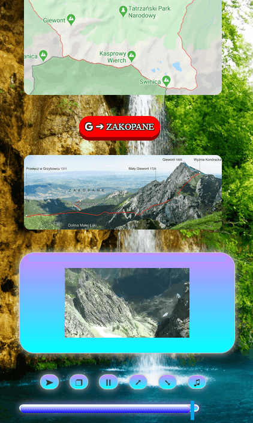

# TatraTravel | WebDesign | Javascript | Project
## Travel Agency Web Project built in grids layout with Responsive Web Design. 

## Live Link
https://jacekbwwa.github.io/Travel-Agency-WebDesign-Project-JB/index.html

## Description
### Structure: The project is split to 5 pages:
- index.html . The home  web page describes and shows pictures, slide pictues and movie of Tatra Mountains, travel and sport activities in this area. The movie player interface, slide images and colur letters feature  programmed  in Javascript, and designed in CSS/HTML.  
- packages.html. The tours web page describes  and shows pictures of Tatra Mountains, Zakopane city, Tatra National Park, Mount Giewont, Morskie Oko Lake, Caves in Tatra Mountains, Mount Kasprowy, and winter activities in this area. The movie player interface, and colur letters feature  programmed  in Javascript, and designed in CSS/HTML.  
- map.html. The  map web page  shows map of  Zakopane city, and movie  of Tatra Mountains. The movie player interface  programmed  in Javascript, and designed in CSS/HTML.Special animation programmed in Javascript shows travelling backpacker.  
- book.html. The booking registration form web page, designed to enter customer 's data and book place  in Travel Agency tour. The entry form programmed in jQuery.  
- registration.html. The confirmation of registration web page.  
### Design:
- In all web pages special graphic design of buttons and views. All web pages designed in grids layout with Responsive Web Design, adapted to PC/mobile browsers.  

## Technologies Used
- HTML/CSS
- JavaScript 
- jQuery
- Web Fonts (from Google Fonts)
- Addapted to PC/mobile browsers (Responsive Web Design)

## Code Explaination
### Code structure - All the javascript code is split in several Javascript files:

- Packages.js. The movie player interface  is designed in Package.js module.  
- createColorLetters.js , createColorLetters2.js.  The modules with functions to create coloured letters sentence.  
- displaySlides.js. The module to choose and display images, after button clicked.  
- backpacker.js. The module to handle animation of bacpacker icon.  
- Css  web page styles  designed to beautify views.  

### Author

**Jacek Byzdra**  
*Software Developer  
jacek.jaroslaw.byzdra@gmail.com  
[Linkedin](https://www.linkedin.com/in/jacek-byzdra/) - [GitHub](https://github.com/jacekbwwa)*

### License
Privacy policy. This work is available under a Creative Commons License Attribution - Non-Commercial Use - No Derivative Works 4.0 International

# Travel-Agency-WebDesign-Project-JB
